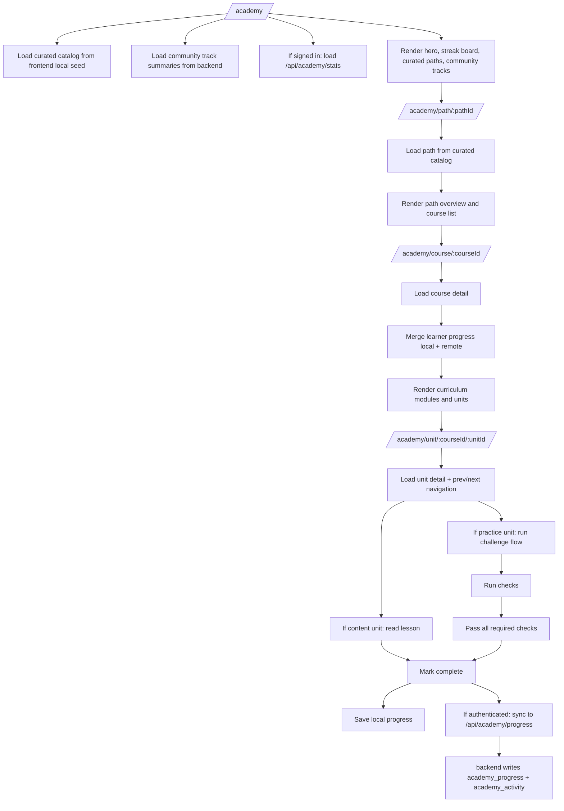
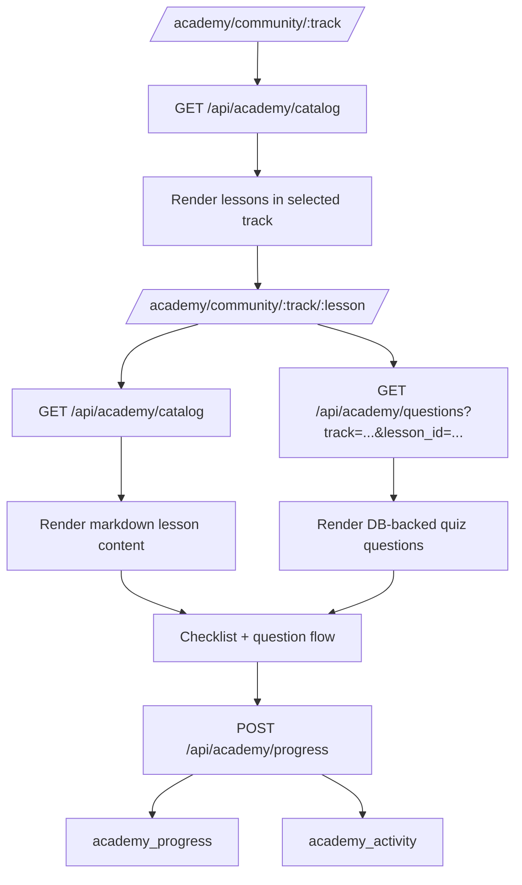
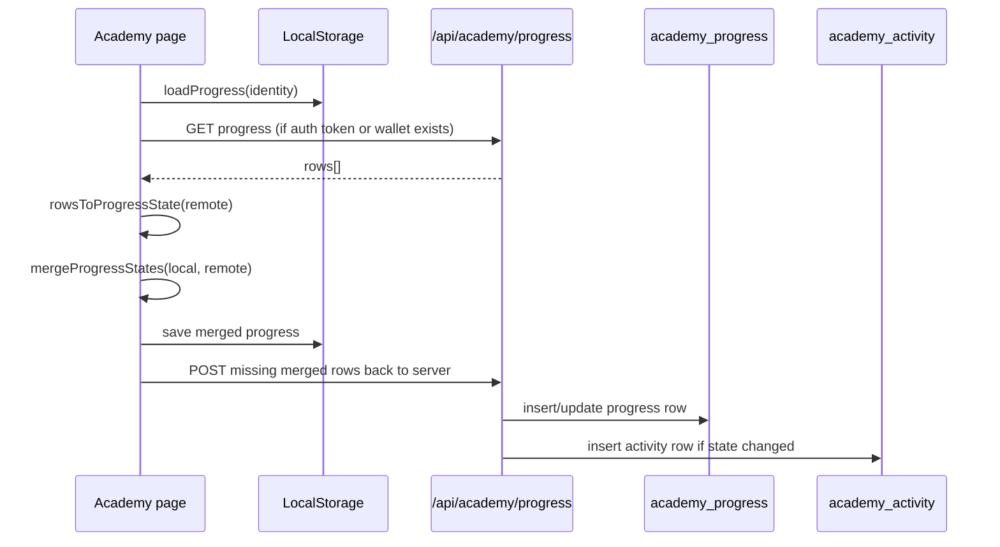

# DSUC Academy: Flow, Architecture, and Content Map

This document describes the current Academy implementation in the DSUC product as it exists in code today.

It covers:
- route map
- learner flow
- admin flow
- data model
- curated Academy v2 vs community legacy lane
- progress/activity/streak logic
- challenge runtime logic
- content inventory

Relevant source files:
- `frontend/App.tsx`
- `frontend/pages/AcademyHome.tsx`
- `frontend/pages/AcademyPath.tsx`
- `frontend/pages/AcademyCourse.tsx`
- `frontend/pages/AcademyUnit.tsx`
- `frontend/pages/AcademyTrack.tsx`
- `frontend/pages/AcademyLesson.tsx`
- `frontend/pages/AcademyAdmin.tsx`
- `frontend/lib/academy/v2Api.ts`
- `frontend/lib/academy/v2LocalCatalog.ts`
- `frontend/lib/academy/useAcademyProgress.ts`
- `frontend/lib/academy/progress.ts`
- `frontend/lib/academy/v2Progress.ts`
- `frontend/lib/academy/challengeRunner.ts`
- `frontend/lib/academy/md.tsx`
- `backend/src/routes/academy.ts`
- `backend/src/lib/academyV2Catalog.ts`
- `backend/src/utils/academyStats.ts`
- `backend/database/schema.sql`
- `backend/database/migration_20260428_dynamic_academy_and_agent_keys.sql`

## 1. High-Level Structure

Academy currently has **two parallel lanes**:

1. `Academy v2 curated lane`
- main Academy experience
- route family:
  - `/academy`
  - `/academy/path/:pathId`
  - `/academy/course/:courseId`
  - `/academy/unit/:courseId/:unitId`
- content source:
  - local seed files bundled into frontend
- progress source:
  - local storage first
  - synced into database when authenticated

2. `Community / legacy lane`
- older DB-driven track/lesson/question flow
- route family:
  - `/academy/community/:track`
  - `/academy/community/:track/:lesson`
- legacy alias redirects:
  - `/academy/track/:track` -> `/academy/community/:track`
  - `/academy/learn/:track/:lesson` -> `/academy/community/:track/:lesson`
- content source:
  - database tables `academy_tracks`, `academy_lessons`, `academy_questions`
- progress source:
  - local storage plus DB sync

Important product decision:
- `/academy` is now the curated Academy v2 entry point.
- community content still exists, but it is no longer the primary learner lane.

## 2. Route Map

Frontend route definitions live in `frontend/App.tsx`.

### Public / learner Academy routes

```text
/academy
  -> AcademyHome

/academy/path/:pathId
  -> AcademyPath

/academy/course/:courseId
  -> AcademyCourse

/academy/unit/:courseId/:unitId
  -> AcademyUnit

/academy/community/:track
  -> AcademyTrack

/academy/community/:track/:lesson
  -> AcademyLesson
```

### Admin route

```text
/academy-admin
  -> AcademyAdmin
  -> only President / Vice-President
```

### Legacy redirects

```text
/academy/track/:track
  -> redirect to /academy/community/:track

/academy/learn/:track/:lesson
  -> redirect to /academy/community/:track/:lesson
```

## 3. Academy v2 Learner Flow

### 3.1 Top-level flow



### 3.2 What actually loads on each page

#### `/academy` -> `AcademyHome`

Responsibilities:
- load curated path catalog
- load community track summaries
- load learner stats if user is signed in
- load progress state from `useAcademyProgressState`
- compute total units and completed units across curated content
- render streak board and progress summary

Data sources:
- `fetchAcademyV2Catalog()`
- `useAcademyProgressState()`
- `GET /api/academy/stats` if authenticated

UI blocks:
- Academy hero
- learner identity / guest badge
- metric cards
- streak board based on `active_days`
- curated paths section
- community tracks section

#### `/academy/path/:pathId` -> `AcademyPath`

Responsibilities:
- fetch full curated catalog
- locate selected path in `curated_paths`
- render path header and course cards
- compute per-course completion from progress state
- gate later courses based on previous-course completion

Lock rule:
- first course is open
- next course is locked until previous course is fully completed

#### `/academy/course/:courseId` -> `AcademyCourse`

Responsibilities:
- fetch full course detail
- flatten units across all modules
- compute course progress and module progress
- identify first incomplete unit
- render course hero and curriculum
- enforce unit lock order

Lock rule:
- within a course, a unit is considered locked if the previous unit is not completed

#### `/academy/unit/:courseId/:unitId` -> `AcademyUnit`

Responsibilities:
- fetch full unit detail plus prev/next unit
- keep draft code in local storage
- show lesson or practice shell
- run challenge checks when applicable
- block completion for runnable practice units until checks pass
- save completion to local state and remote DB

Special local draft key:
- `academy-lab-draft:<courseId>:<unitId>`

Workspace tabs:
- `editor`
- `results`
- `solution`

Completion rule:
- content unit:
  - can complete directly
- practice unit with runnable challenge:
  - must pass required checks first
- practice unit without runnable verifier:
  - can still be used as guided lab, depending on runtime support

## 4. Curated Academy v2 Content Model

The curated lane is not DB-driven for content.

It is built from local seed files in the frontend bundle:
- `frontend/content/academy-v2/seed/learningPath.json`
- `frontend/content/academy-v2/seed/course.json`
- `frontend/content/academy-v2/seed/modules.json`
- `frontend/content/academy-v2/seed/lessons.json`
- `frontend/content/academy-v2/seed/instructor.json`

The local catalog builder lives in:
- `frontend/lib/academy/v2LocalCatalog.ts`

### 4.1 Entity hierarchy

```text
Path
  -> Course
    -> Module
      -> Unit
```

### 4.2 Unit model

Unit types:
- `content`
- `challenge`
- `quiz`

Unit sections:
- `learn`
- `practice`

Current real behavior:
- `content` units are rendered as lesson content
- `challenge` units are rendered in challenge / practice workspace
- `quiz` exists in type definitions, but curated lane currently behaves mostly as lesson + challenge flow

### 4.3 Current curated content inventory

Current seed counts:
- paths: `7`
- courses: `6`
- modules: `19`
- lessons/units: `76`
- instructors: `4`

Current paths:

1. `Solana Core` (`solana-core`)
- `Solana Fundamentals`
- `Building Your First Solana Program`

2. `Rust & Programs` (`rust-programs`)
- `Rust for Solana Developers`
- `Anchor Framework Mastery`

3. `Frontend` (`frontend`)
- `Solana Frontend Development`

4. `DeFi` (`defi`)
- `DeFi on Solana`

5. `Infrastructure` (`infrastructure`)
- no courses yet

6. `AI x Solana` (`ai-solana`)
- no courses yet

7. `Security & Auditing` (`security`)
- no courses yet

Current course inventory summary:

1. `Solana Fundamentals`
- modules: `3`
- units: `12`
- learn: `7`
- practice: `5`

2. `Building Your First Solana Program`
- modules: `4`
- units: `16`
- learn: `8`
- practice: `8`

3. `Rust for Solana Developers`
- modules: `3`
- units: `12`
- learn: `7`
- practice: `5`

4. `Anchor Framework Mastery`
- modules: `3`
- units: `12`
- learn: `7`
- practice: `5`

5. `Solana Frontend Development`
- modules: `3`
- units: `12`
- learn: `7`
- practice: `5`

6. `DeFi on Solana`
- modules: `3`
- units: `12`
- learn: `7`
- practice: `5`

## 5. Academy v2 Content Delivery Strategy

Academy v2 uses a **local-first frontend content strategy**.

### 5.1 Why curated content still works without backend content APIs

`frontend/lib/academy/v2Api.ts` no longer depends on the backend for curated content payloads.

Instead:
- `fetchAcademyV2Catalog()`
  - curated paths from local seed
  - community track summaries from backend
- `fetchAcademyV2Course()`
  - local seed only
- `fetchAcademyV2Unit()`
  - local seed only

### 5.2 Browser cache

Curated content is cached in local storage:
- cache key prefix:
  - `academy-v2-cache:<apiBase>:...`

TTL:
- catalog: `30 minutes`
- course: `30 minutes`
- unit: `10 minutes`

Versioning:
- `ACADEMY_V2_CACHE_VERSION = 2026-04-29-v2`

### 5.3 Important dual-source note

Curated Academy content exists in **two copies**:

1. frontend seed:
- used by learner UI

2. backend seed:
- used by:
  - server-side validation for curated progress targets
  - admin curated browser
  - curated analytics mapping

Backend seed location:
- `backend/content/academy-v2/seed/*`
- consumed by `backend/src/lib/academyV2Catalog.ts`

Implication:
- if frontend seed and backend seed diverge, learner UI and progress validation can drift apart
- these two seed copies must be kept aligned

## 6. Community Legacy Lane

The community lane is fully DB-driven.

### 6.1 Content tables

- `academy_tracks`
- `academy_lessons`
- `academy_questions`

### 6.2 Learner flow



### 6.3 Legacy lesson specifics

`AcademyLesson.tsx` does the following:
- loads track catalog from `/api/academy/catalog`
- loads DB questions from `/api/academy/questions`
- sanitizes stale local progress against valid lesson keys
- merges local and remote progress
- tracks checklist state
- tracks quiz answers
- marks lesson completion
- can show celebration UI for final lesson in a track

Community track page `AcademyTrack.tsx`:
- loads the selected track from `/api/academy/catalog`
- reads local progress
- gates lessons sequentially

## 7. Progress Model

Progress is shared conceptually across both lanes, but the curated and community lanes use different content sources.

### 7.1 Local progress state shape

Defined in `frontend/lib/academy/progress.ts`:

```text
ProgressState
  completedLessons: Record<string, boolean>
  quizPassed: Record<string, boolean>
  checklist?: Record<string, boolean[]>
  xp: number
  updatedAt: string
```

Key format:
- `${track}:${lessonId}`

### 7.2 Local progress storage

Local key prefix:
- `st-academy-progress-v2:`

Identity partition:
- `member:<userId>`
- `wallet:<walletAddress>`
- `guest`

This means Academy progress is stored separately per identity.

### 7.3 Curated progress namespace

Curated Academy v2 uses namespaced progress track IDs:
- `academy-v2-<courseId>`

Helpers are in `frontend/lib/academy/v2Progress.ts`.

Examples:
- `academy-v2-solana-fundamentals:intro-to-runtime`
- `academy-v2-anchor-framework:pda-challenge`

Backward compatibility:
- old non-prefixed curated keys can still be recognized

### 7.4 Remote progress rows

Database table `academy_progress`:

```text
id
user_id
track
lesson_id
lesson_completed
quiz_passed
checklist
xp_awarded
created_at
updated_at
UNIQUE(user_id, track, lesson_id)
```

Meaning:
- one row per learner + content target
- row is the latest canonical snapshot for that target

### 7.5 Activity rows

Database table `academy_activity`:

```text
id
user_id
track
lesson_id
action
lesson_completed
quiz_passed
checklist
xp_snapshot
recorded_at
```

Allowed actions:
- `started`
- `checklist_updated`
- `lesson_completed`
- `quiz_passed`
- `progress_updated`
- `lesson_reviewed`

Meaning:
- append-only learning history
- used to build streak and admin history

## 8. Progress Sync Flow

### 8.1 Curated Academy v2 sync flow



### 8.2 Why progress can survive reload even if DB is empty

Because local storage is the first source of truth at page load.

Flow:
- page loads local progress immediately
- remote fetch happens after that if auth exists
- merged state is shown in UI

That is why progress can appear correct visually even before DB sync succeeds.

### 8.3 Current sync repair logic

`useAcademyProgressState()` now explicitly:
- loads local identity state
- if signed-in identity exists, also loads guest state
- merges guest + signed-in local progress
- fetches remote rows
- merges local + remote
- saves merged result locally
- posts missing rows back to `/api/academy/progress`

This backfill is important because:
- guest learning can later be attached to signed-in identity
- local-only curated progress can be replayed into DB
- streak can only use DB-backed timeline rows

### 8.4 Remote auth condition

Remote sync is attempted when either exists:
- auth token
- wallet address

This matters because:
- `currentUser` hydration can lag behind token availability
- progress sync should not wait for full profile hydration

## 9. Streak Logic

Streak calculation lives in:
- `backend/src/utils/academyStats.ts`

### 9.1 Time zone

Streak uses:
- `Asia/Ho_Chi_Minh`

Daily keys are normalized with:
- `academyDateKey()`

### 9.2 Streak algorithm

Algorithm:

1. collect all timestamps from:
- `recorded_at`
- `updated_at`
- `created_at`

2. convert each to local academy day key

3. build set of active days

4. if neither today nor yesterday is active:
- streak = `0`

5. otherwise walk backward day by day until a gap appears

Implications:
- streak does not require activity today specifically
- yesterday still preserves the streak chain
- streak is ultimately based on saved timeline rows, not just visible UI state

### 9.3 What `/api/academy/stats` returns

For the current authenticated learner:
- `streak`
- `academy_xp`
- `completed_lessons`
- `quiz_passed`
- `last_activity`
- `active_days`

`active_days` is used by `AcademyHome.tsx` to render the streak board.

## 10. Challenge Runtime

Challenge runtime lives in:
- `frontend/lib/academy/challengeRunner.ts`

### 10.1 Runtime types

The runner returns a `ChallengeRunReport`:
- `supported`
- `allPassed`
- `passedCount`
- `totalCount`
- visible and hidden case counts
- `primaryFunction`
- `runtimeLabel`
- `message`
- `cases[]`

### 10.2 Runtime modes

There are multiple challenge verification modes:

1. `Browser challenge runner`
- for JS-like / TypeScript-style challenge logic
- executes local verification in browser

2. `Guided Rust verifier`
- for Rust units that are not full real builds
- validates lesson-specific structure and logic heuristically

3. `Rust scaffold verifier`
- for `buildable` Rust / Anchor-style lessons
- validates required scaffold and structure heuristically
- explicitly not a real `cargo build` or `anchor build`

4. unsupported / guided-only mode
- unit can still render as guided practice
- but may not be executable

### 10.3 Challenge verification strategy

The runner uses several approaches:
- code normalization
- known pattern matching / heuristics
- lesson-specific expected structure
- visible and hidden test cases
- fast-path solution equivalence:
  - if normalized learner code matches normalized reference solution, it can pass immediately

### 10.4 Completion gate for practice units

In `AcademyUnit.tsx`:
- if the unit is runnable practice
- and the learner has not passed all required checks
- the complete action is blocked

Message shown:
- wait for run if still executing
- or pass all checks, including hidden checks

Only after passing:
- `persistUnitCompletion()` can mark it complete

## 11. Markdown / Lesson Rendering

Lesson rendering uses:
- `react-markdown`
- `remark-gfm`

Renderer file:
- `frontend/lib/academy/md.tsx`

Supported formatting:
- headings with slug IDs
- paragraph styling
- bold / italic
- unordered lists
- ordered lists
- blockquotes
- links
- horizontal rules
- tables
- code blocks
- inline code
- task list checkboxes

Code blocks are rendered through:
- `CodeSurface`

So lesson code display and challenge code display now share a closer visual language.

## 12. Admin Flow

Admin UI lives at:
- `/academy-admin`

Access:
- President
- Vice-President

### 12.1 Admin has two responsibilities

1. manage community / legacy content
2. inspect curated v2 content and analytics

### 12.2 Community admin capabilities

CRUD is available for:
- tracks
- lessons
- questions

Backend routes:
- `GET /api/academy/admin/tracks`
- `POST /api/academy/admin/tracks`
- `PATCH /api/academy/admin/tracks/:id`
- `DELETE /api/academy/admin/tracks/:id`

- `GET /api/academy/admin/lessons`
- `POST /api/academy/admin/lessons`
- `PATCH /api/academy/admin/lessons/:id`
- `DELETE /api/academy/admin/lessons/:id`

- `GET /api/academy/admin/questions`
- `POST /api/academy/admin/questions`
- `PATCH /api/academy/admin/questions/:id`
- `DELETE /api/academy/admin/questions/:id`

Validation rules:
- lesson belongs to a valid track
- question belongs to an existing lesson
- minimum choice validation
- `correct_choice_id` must match a real choice

### 12.3 Curated admin capabilities

Curated v2 content is currently **browse/inspect only**, not CRUD.

Available curated admin endpoints:
- `GET /api/academy/admin/v2/catalog`
- `GET /api/academy/admin/v2/course/:courseId`
- `GET /api/academy/admin/v2/unit?course_id=...&unit_id=...`
- `GET /api/academy/admin/v2/analytics`

Meaning:
- curated content is still code-seeded
- admin can inspect it
- admin can observe metrics
- admin cannot author curated path/course/module/unit from UI yet

### 12.4 Learner overview and activity history

Admin also has:
- `GET /api/academy/admin/overview`
- `GET /api/academy/admin/history`

`overview` aggregates by member:
- xp
- completed lessons
- quiz passed
- streak
- last activity

`history` exposes chronological activity rows with member info attached.

### 12.5 Curated analytics

`/api/academy/admin/v2/analytics` computes:
- lane split:
  - curated rows
  - community rows
  - curated xp
  - community xp
  - curated learners
  - community learners
- top paths
- top courses

Classification rule:
- if `academy_progress.track` maps to a curated course via `academyV2CourseIdFromProgressTrack()`
  - it is counted as curated
- otherwise
  - it is counted as community

## 13. Backend API Map for Academy

### 13.1 Public learner content endpoints

- `GET /api/academy/catalog`
  - published community tracks + lessons

- `GET /api/academy/v2/catalog`
  - curated paths + community track summaries

- `GET /api/academy/v2/course/:courseId`
  - full curated course detail

- `GET /api/academy/v2/unit?course_id=...&unit_id=...`
  - curated unit detail + prev/next unit

- `GET /api/academy/questions?track=...&lesson_id=...`
  - published legacy/community lesson questions

### 13.2 Authenticated learner state endpoints

- `GET /api/academy/stats`
  - current learner streak/xp/activity summary

- `GET /api/academy/progress`
  - current learner progress rows

- `POST /api/academy/progress`
  - insert/update a progress row
  - also records `academy_activity` when there is a real state transition

### 13.3 Admin endpoints

- community CRUD:
  - tracks / lessons / questions
- curated browse:
  - admin v2 catalog / course / unit
- analytics:
  - overview / history / v2 analytics

## 14. Detailed Completion Semantics

### 14.1 When a row is allowed

`POST /api/academy/progress` accepts a target only if:

1. it matches a DB lesson in `academy_lessons`
- community lane

or

2. it matches a curated v2 unit according to:
- `isAcademyV2ProgressTarget(track, lessonId)`

So the backend prevents arbitrary unknown track/unit writes.

### 14.2 Activity generation rules

Backend decides activity action by comparing existing row vs incoming payload:

- new row + quiz passed -> `quiz_passed`
- new row + lesson completed -> `lesson_completed`
- new row + checklist -> `checklist_updated`
- new row with nothing else -> `started`
- existing row moving to completed -> `lesson_completed`
- existing row moving to quiz passed -> `quiz_passed`
- changed checklist -> `checklist_updated`
- changed xp only -> `progress_updated`
- review flag + completed -> `lesson_reviewed`

If nothing changed:
- no new activity row is written

### 14.3 XP semantics

Local inferred XP:
- `100` per completed lesson in merged local progress calculations

Remote persisted XP:
- whatever `xp_awarded` is supplied by completion calls
- in curated `AcademyUnit`, the completion payload uses:
  - `unit.xp_reward`
- in sync backfill, missing rows can be posted with:
  - `100` when completed

Implication:
- local UI can infer XP even before remote rows exist
- server XP is the actual persisted aggregate

## 15. Known Architectural Decisions and Caveats

### 15.1 Curated content is code-seeded, not CMS-driven

This is intentional right now:
- easier backup
- content ships with code
- no dependency on admin authoring pipeline

Tradeoff:
- content updates require code changes and redeploy

### 15.2 Curated content is duplicated frontend + backend

This is the biggest structural caveat.

Why duplication exists:
- frontend needs local-first content rendering
- backend needs validation and analytics mapping

Risk:
- seed drift between frontend and backend copies

### 15.3 Curated admin is not CRUD yet

Current state:
- curated content can be inspected in admin
- community content can be edited in admin

So Academy currently has:
- curated learner UX
- community authoring workflow
- but not yet curated authoring workflow

### 15.4 Streak depends on DB-backed activity

If a learner only progresses locally and never successfully syncs:
- UI can still show progress
- but streak, activity history, and admin analytics will not reflect that learning

That is why the recent sync/backfill fix is critical.

### 15.5 Guest mode is supported for reading and learning

Public routes allow:
- browsing Academy
- opening curated content
- opening community content

But DB-backed learner state still requires authentication.

### 15.6 Community and curated lanes are intentionally separate

Curated Academy v2:
- path -> course -> module -> unit

Community legacy:
- track -> lesson -> question

They share:
- progress table
- activity table
- streak engine
- admin surface

But they do not share the same content authoring model.

## 16. Practical Summary

If someone asks "how Academy works today", the shortest accurate answer is:

1. The main Academy experience is now **curated Academy v2**.
2. Curated content is **hardcoded/local seed in code**, not DB-authored.
3. Community content is still **DB-driven** and lives under `/academy/community/...`.
4. Learner progress is **local-first**, then synced to:
- `academy_progress`
- `academy_activity`
5. Streak is calculated server-side from activity/progress timestamps in `Asia/Ho_Chi_Minh`.
6. Challenge runtime is **browser/local heuristic verification**, not real Solana infra build execution.
7. Admin can fully manage community content, but for curated v2 it can currently only inspect and analyze.

